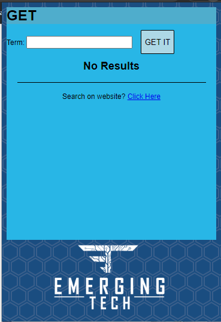
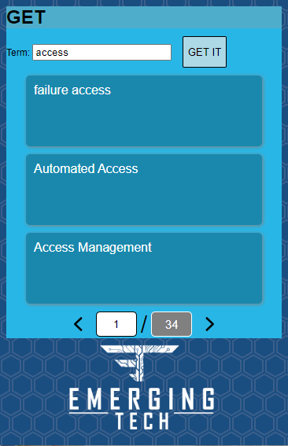
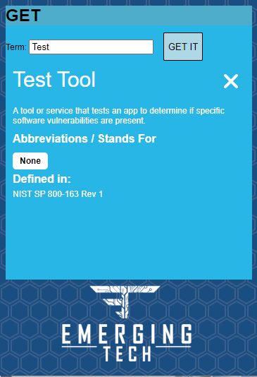

<!-- PROJECT LOGO -->
<br />
<p align="center">
  <a href="https://github.com/ericdequ/GetExtension">
    
  </a>

  <h3 align="center">GET Extension</h3>

  <p align="center">
    A glossary for emerging tech terms!
    <br />
    <a href="https://github.com/ericdequ/GetExtension"><strong>Find us on chrome web store! (coming soon) »</strong></a>
    <br />
    <br />
    <a href="#usage">View Demo</a>
    ·
    <a href="https://github.com/ericdequ/GetExtension">Report Bug</a>
    ·
    <a href="https://github.com/ericdequ/GetExtension">Request Feature</a>
  </p>
</p>


<!-- TABLE OF CONTENTS -->
<details open="open">
  <summary>Table of Contents</summary>
  <ol>
    <li>
      <a href="#about-the-project">About The Project</a>
    </li>
    <li>
      <a href="#getting-started">Getting Started</a>
      <ul>
        <li><a href="#dependencies">Dependencies</a></li>
        <li><a href="#installation">Installation</a></li>
      </ul>
    </li>
    <li><a href="#usage">Usage</a></li>
    <li><a href="#authors">Authors</a></li>
    <li><a href="#acknowledgements">Acknowledgements</a></li>
  </ol>
</details>


<!-- ABOUT THE PROJECT -->
## About The Project

The GET app, also known as the Glossary of Emerging Tech, is a revolutionary google chrome extension that allows users to quickly search for industry related acronyms. We realized the need for this software when we realized how inconsistent and potentially distracting that a regular search engine can be for finding industry specific terms.


<!-- GETTING STARTED -->
## Getting Started


### Dependencies

We require that users use a current version of Google Chrome (version 88.0.4324 or upwards). This install of Google Chrome must also have JavaScript enabled. An internet connection is required to install the extension from the Chrome Web Store and also for searches to be processed.

  
### Installation
We soon hope to be on the chrome web store but for now this is how we use the extension.

1. Clone the repo
   ```sh
   git clone https://github.com/ericdequ/GetExtension.git
   ```
2. Make sure you have developer mode enabled and "load unpacked" to install the extension!

<!-- USAGE EXAMPLES -->
## Usage
When a user first presses on the GET button on the toolbar, a menu similar to the one pictured below will load near to where you pressed the button.
<p align="left">
  <a href="https://github.com/ericdequ/GetExtension">
    
  </a>

The user must then type in the desired acronym they wish to search for and then press "GET IT". A list of items will populate the extension window. We are using term "access" for this demonstration.

<p align="left">
  <a href="https://github.com/ericdequ/GetExtension">
    
  </a>

The user must then press the term they are searching for and more information will appear on the term.

<p align="left">
  <a href="https://github.com/ericdequ/GetExtension">
    
  </a>

To close the window, just click anywhere else on the chrome browser!

<!-- CONTRIBUTING -->
## Contributing

We do not need people to contibute to the project at the moment, but if you are interested in being an admin, feel fee to reach out to us by email at (insert email here).


<!-- Authors -->
## Authors

This project was done entirely by SEI team at Emerging Tech LLC.
 
(up to you guys if you want to list everyone individually).


<!-- ACKNOWLEDGEMENTS -->
## Acknowledgements

* [Emerging Tech LLC](https://emergingtech.co/)
* [Gaurav Seth](https://www.linkedin.com/in/sethgrv/)
* [Shaylee Scott](https://www.linkedin.com/in/shaylee-scott/)

## Thank you!
